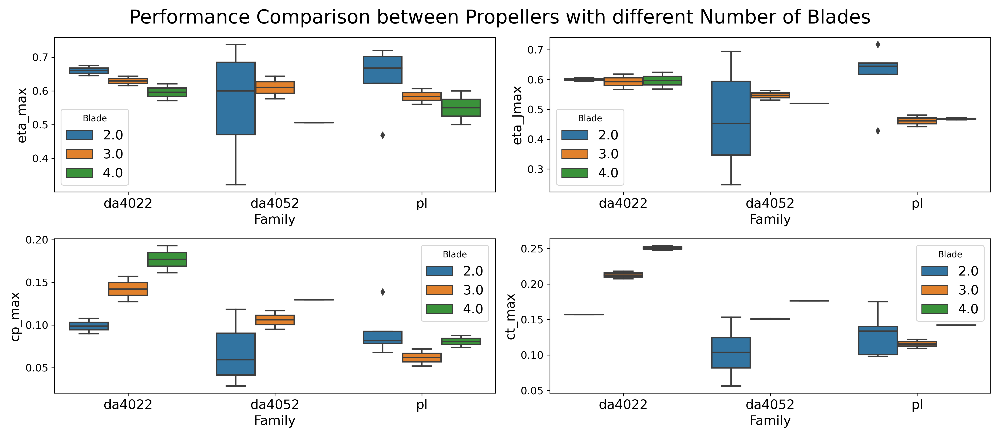
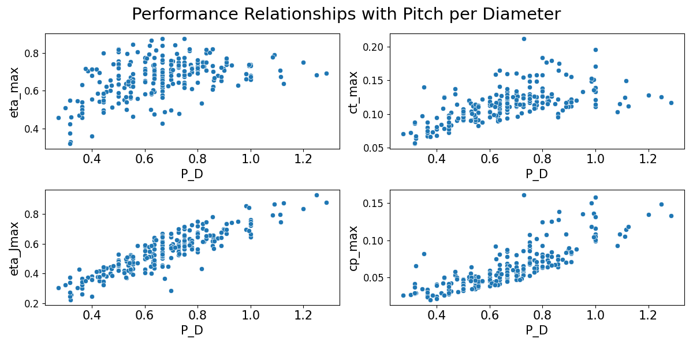
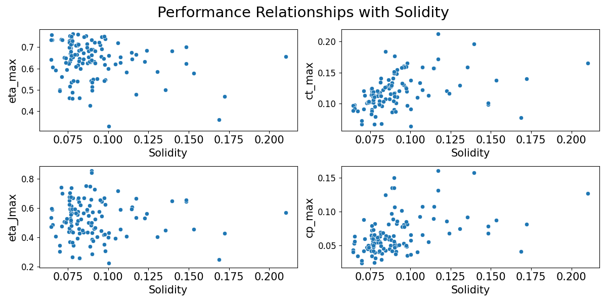
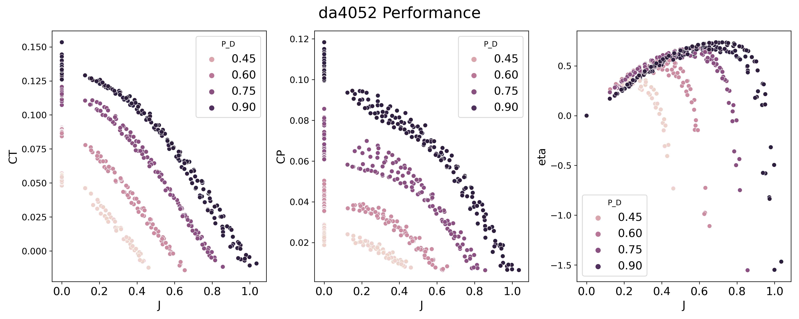
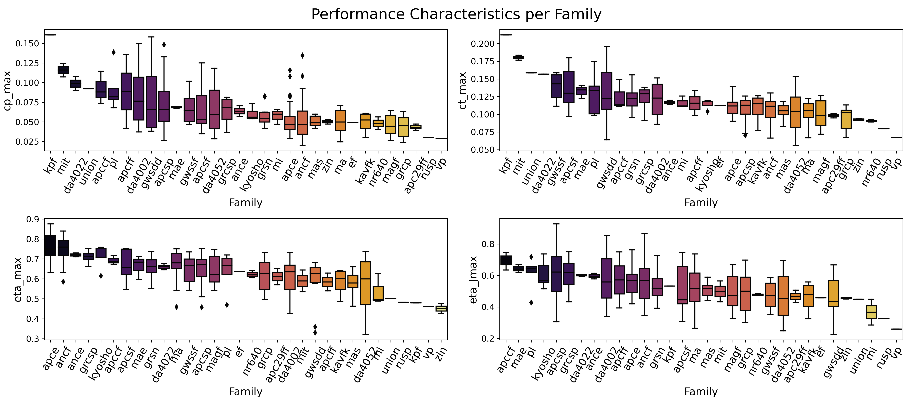
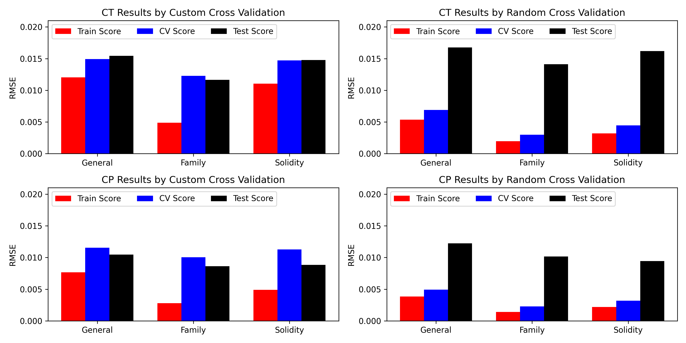
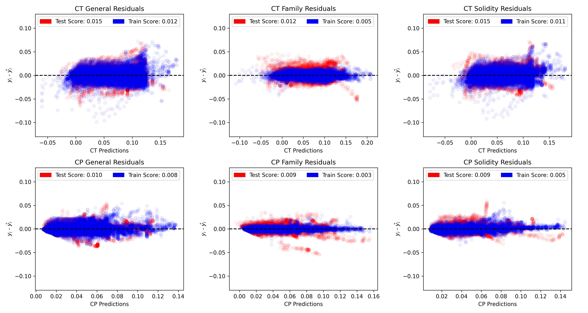

Two Blade Propeller Surrogate Model
==============================

### Libraries Used:

**Data Extraction and Cleaning**: *parse*, *os*  
**Feature Engineering**: *category-encoders*,  *scipy* 
**Data Analysis**: *matplolib*, *seaborn*, *numpy*, *pandas* 
**Machine Learning**: *xgboost*, *scikit-learn*, *optuna*, *pendulum* 
**Deployment**: *streamlit*  

When designing a UAV, something that must be taken into consideration is its propulsive system. Good predictions of its performance curves guarantee a robust and reliable project. To achieve this, numerical and experimental methods can be used. However, both have their disadvantages. Numerical methods require time, are computationally expensive and need a defined geometry of the propeller to be applied, in addition to a advanced knowledge of the designer. Experimental tests require wind tunnels and calibrated equipment for the correct measurement of the propellers. A third alternative is use surrogate models, which consist of compact models to estimate complex results, based on experimental or/and simulation data. Thus, the designer can quickly predict the performance of a propeller, choosing optimal parameters for preliminary propeller design, or making decisions such as purchase of commercial propellers based on parameters provided by the manufacturer.

Data Extraction and Feature Engineering
---

Initially, primary data was collected from hundreds of files
csv from the UIUC database.  The files, in turn, are already divided into two types in the database. What will be called type 1, contains the test of a propeller, each
with defined Pitch and Diameter and at a given Rotation, with four columns: Advance Ratio, Traction Coefficient, Power Coefficient and Efficiency. What will be called
of type 2, contains, for each Propeller and Manufacturer name, the distribution of the chord and angle twist along the radius.

The reason for the discrepancy between the number of different helices and the number of files type 2 is that, although all tests were carried out in the same wind tunnel and following the same experimental conditions, only to those who took part in the work by Brandt and Selig (2011) the distribution of the chord was recorded. Using text and string file manipulation tools, the data from type 1 files, structuring them into an array with the following attributes: Propeller Name, Manufacturer (Family), Pitch per Diameter, Advance Ratio, Rotation,  Traction Coefficient, Power Coefficient and Efficiency. For type 2, an integration was applied numerical, obtaining, then, the Solidity. The results were structured as another matrix, with the attributes of Propeller Name and Solidity given the following equation.

$\sigma$ = $\frac{4B}{\pi D^2} \large{\int_{0}^{D/2}}$ $c(r)dr$

Were $B$ is blade numbers, $D$ the diameter, $c$ the chord, and $r$ the radius.

Data Analysis
--------------------------------

Before creating our surrogate models, we first have to do a exploratory analysis in order to give insights and other information that will contribute to our modeling process.

### Number of Blades

Our dataset contains 254 propellers, 243 of them are two bladed, 6 three bladed and 5 four bladed. Considering that the vast majority of the propellers are two bladed, we decided to exclude the other types of propellers. But first, let's compare the difference in performance given the number of blades. 

As we can see, the maximum CT increases, but also the maximum CP, in other words, more blades can lead to a higher traction, but will require more power. Its worth noting that the maximum efficiency is reduced as the number of blades increases. 

### P/D and Solidity

the Pitch per Diameter and Solidity are important geometric properties of the propellers. Let's look at how they relate to the overall performance.

The increse in P/D results in a increase in CT and CP, which doesn't directly translates into a increase in efficiency, but it allows the efficiency to achieve higher values with higher P/D. Interesting enough, P/D and the advanced ratio that in which the propeller achieves maximum efficiency are strongly correlated, which indicates that low P/D are prefered in high rotation conditions and higher P/D are prefered in low rotation conditions.

Althogh we can't conclude much about the relationship between solidity and efficiency, CT and CP increases as the solidity increases. A more depth statistical analysis is recommended to investigate this relationships.

### Advanced Ratio

As for the advanced ratio, it was decided to plot the propellers in gropus considering their families. The P/D was used to stratify the propellers.

These are the propellers from DA4052, whose behaviour can be generalized for all families:
the CT and CP descreases as the advanced ratio increases. Higher P/D translates into higher CT and CP values and maximum efficiency advanced ratio increases as P/D increases as was previously discussed.

### Performance per Family

To see the distinction between the Families, its performance characteristics were analyzed.

Given the above figure, it is quite clear that the maximum performance values can be used as a way to distinguish different families. This will be latter used in our modeling.

Model Training
-------

In order to create our surrogate models, Three approaches are used: General approach (we don't know the Propellers' Family), Family approach (Propeller's Family is considered), and Solidity (Solidity is considered). Since Solidity is not generally given by the manufacturer, we can't consider a approach we the family and the solidty are simultaneously used. For preprocessing the families feature, the Quantile Encoder was is used. The reason why this encoding was selected over the Mean Encoder was because of the results obtained in our data analysis, which the higher values performance could lead to a distinction between the families. The quantile selected can also be considered a hyperparament, giving the encoding more flexibility. A more correct encode would be to retrieve the maximum performance values of all the propellers and return a smoothed average as our encode value. This encode wasn't implemented due to its difficulty, and will be considered for further improvements.

The dataset was divded in a Training (70%) and a Test (30%) Set, having each set different propellers, proportionally stratified by their families. As for Cross Validation, each validation set contained propellers that weren't present in the partial training set, in other to emulate the condition the we established into making the Training and Test set. We can see below that our Cross Validation has way less overfitting than a random Cross Validation, since it randomly takes values for all propellers, giving it a overly optimistic model.  

After this project, I studied cross validation more, and realise that our CV approach was actually a Group KFold approach, implemented in scikit-learn.

Having our stes defined, a XGBoost algortihm is trained, having its hyperparameter selection conducted by Bayesian Optimization, via Optuna framework. The training resulted in the following results: 

Assuming the propellers' family considerably improve the CT and CP results, and the Solidity assumption gave improvements for the CP. This is expected since half of the propellers don't have information regarding its chord dsitributions.

Deployment
---
The deployment was made as a web application with streamlit Framework, which can be acessed here: https://surrogate-propeller.streamlit.app/. Quantiles from the model were also trained to give our results coverage.

Project Organization
------------

    ├── LICENSE
    ├── Makefile           <- Makefile with commands like `make data` or `make train`
    ├── README.md          <- The top-level README for developers using this project.
    ├── data
    │   ├── interim        <- Intermediate data that has been transformed.
    │   ├── processed      <- The final, canonical data sets for modeling.
    │   └── raw            <- The original, immutable data dump.
    │
    ├── docs               <- A default Sphinx project; see sphinx-doc.org for details
    │
    ├── models             <- Trained and serialized models, model predictions, or model summaries
    │
    ├── references         <- Data dictionaries, manuals, and all other explanatory materials.
    │
    ├── reports            <- Generated analysis as HTML, PDF, LaTeX, etc.
    │   └── figures        <- Generated graphics and figures to be used in reporting
    │
    ├── pages              <- secondary pages for web application.
    ├── requirements.txt   <- The requirements file for reproducing the analysis environment, e.g.
    │                         generated with `pip freeze > requirements.txt`
    │
    ├── setup.py           <- makes project pip installable (pip install -e .) so src can be imported
    ├── src                <- Source code for use in this project.
    │   ├── __init__.py    <- Makes src a Python module
    │   │
    │   ├── features       <- Scripts to turn raw data into features for modeling
    │   │   ├── data_cleaning.py
    |   |   ├── data_extraction.py
    |   |   └── feature_engineering.py
    │   │
    │   ├── models         <- Scripts to train models and then use trained models to make
    │   │   │                 predictions
    │   │   ├── studies    <- Saved studies from Hyperparameter Optimization
    │   │   ├── eval_models.py
    │   │   ├── generate_models.py
    │   │   ├── generate_studies.py
    │   │   ├── make_train_test.py
    │   │   └── generate_models.py
    │   │
    │   └── visualization  <- Scripts to create exploratory and results oriented visualizations
    │       └── visualize.py
    │
    ├── SurrrogateProp.py  <- Surrogate Propeller model.
    ├── Main_Page.py       <- Main web application page.
    └── tox.ini            <- tox file with settings for running tox; see tox.readthedocs.io
    

--------

<small>Project based on the <a target="_blank" href="https://drivendata.github.io/cookiecutter-data-science/">cookiecutter data science project template</a>. #cookiecutterdatascience</small>

