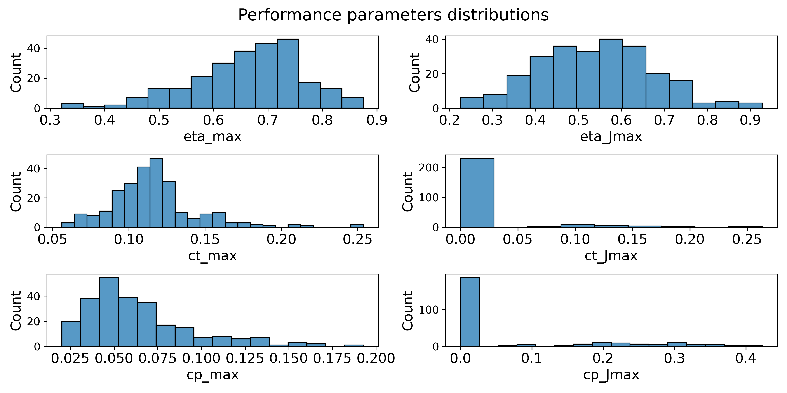

Two Blade Propeller Surrogate Model
==============================

When designing a UAV, something that must be taken into consideration is its propulsive system. Good predictions of its performance curves guarantee a robust and reliable project. To achieve this, numerical and experimental methods can be used. However, both have their disadvantages. Numerical methods require time, are computationally expensive and need a defined geometry of the propeller to be applied, in addition to a advanced knowledge of the designer. Experimental tests require wind tunnels and calibrated equipment for the correct measurement of the propellers. A third alternative is use surrogate models, which consist of compact models to estimate complex results, based on experimental or/and simulation data. Thus, the designer can quickly predict the performance of a propeller, choosing optimal parameters for preliminary propeller design, or making decisions such as purchase of commercial propellers based on parameters provided by the manufacturer.

Data Extraction and Feature Engineering
---

Initially, primary data was collected from hundreds of files
csv from the UIUC database.  The files, in turn, are already divided into two types in the database. What will be called type 1, contains the test of a propeller, each
with defined Pitch and Diameter and at a given Rotation, with four columns: Advance Ratio, Traction Coefficient, Power Coefficient and Efficiency. What will be called
of type 2, contains, for each Propeller and Manufacturer name, the distribution of the chord and angle twist along the radius.

The reason for the discrepancy between the number of different helices and the number of files type 2 is that, although all tests were carried out in the same wind tunnel and following the same experimental conditions, only to those who took part in the work by Brandt and Selig (2011) the distribution of the chord was recorded. Using text and string file manipulation tools, the data from type 1 files, structuring them into an array with the following attributes: Propeller Name, Manufacturer (Family), Pitch per Diameter, Advance Ratio, Rotation,  Traction Coefficient, Power Coefficient and Efficiency. For type 2, an integration was applied numerical, obtaining, then, the Solidity. The results were structured as another matrix, with the attributes of Propeller Name and Solidity given the following equation.

$\sigma$ = $\frac{4B}{\pi D^2} \large{\int_{0}^{D/2}}$ $c(r)dr$

Were $B$ is blade numbers, $D$ the diameter, $c$ the chord, and $r$ the radius.

Data Analysis
--------------------------------

### Performance  parameters distributions

### Number of Blades

|   Blade |   count |
|--------:|--------:|
|       2 |     243 |
|       3 |       6 |
|       4 |       5 |

### P/D and Solidity

### Performance per Family

### Advanced Ratio and P/D relationships

Model Training
-------

Project Organization
------------

    ├── LICENSE
    ├── Makefile           <- Makefile with commands like `make data` or `make train`
    ├── README.md          <- The top-level README for developers using this project.
    ├── data
    │   ├── interim        <- Intermediate data that has been transformed.
    │   ├── processed      <- The final, canonical data sets for modeling.
    │   └── raw            <- The original, immutable data dump.
    │
    ├── docs               <- A default Sphinx project; see sphinx-doc.org for details
    │
    ├── models             <- Trained and serialized models, model predictions, or model summaries
    │
    ├── references         <- Data dictionaries, manuals, and all other explanatory materials.
    │
    ├── reports            <- Generated analysis as HTML, PDF, LaTeX, etc.
    │   └── figures        <- Generated graphics and figures to be used in reporting
    │
    ├── pages              <- secondary pages for web application.
    ├── requirements.txt   <- The requirements file for reproducing the analysis environment, e.g.
    │                         generated with `pip freeze > requirements.txt`
    │
    ├── setup.py           <- makes project pip installable (pip install -e .) so src can be imported
    ├── src                <- Source code for use in this project.
    │   ├── __init__.py    <- Makes src a Python module
    │   │
    │   ├── features       <- Scripts to turn raw data into features for modeling
    │   │   ├── data_cleaning.py
    |   |   ├── data_extraction.py
    |   |   └── feature_engineering.py
    │   │
    │   ├── models         <- Scripts to train models and then use trained models to make
    │   │   │                 predictions
    │   │   ├── studies    <- Saved studies from Hyperparameter Optimization
    │   │   ├── eval_models.py
    │   │   ├── generate_models.py
    │   │   ├── generate_studies.py
    │   │   ├── make_train_test.py
    │   │   └── generate_models.py
    │   │
    │   └── visualization  <- Scripts to create exploratory and results oriented visualizations
    │       └── visualize.py
    │
    ├── SurrrogateProp.py  <- Surrogate Propeller model.
    ├── Main_Page.py       <- Main web application page.
    └── tox.ini            <- tox file with settings for running tox; see tox.readthedocs.io
    

--------

<small>Project based on the <a target="_blank" href="https://drivendata.github.io/cookiecutter-data-science/">cookiecutter data science project template</a>. #cookiecutterdatascience</small>

